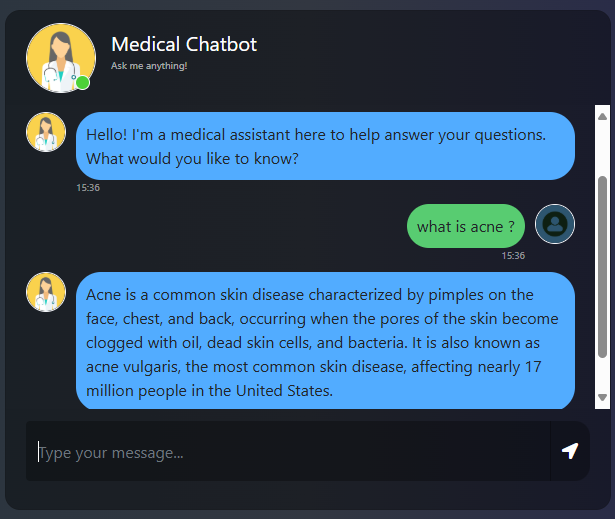

# Medical Chatbot
A medical assistant chatbot built with LangChain, Pinecone, and Groq LLMs.

## Features

- Load and process PDF documents for knowledge base
- Split text into chunks for efficient retrieval
- Generate embeddings using HuggingFace models
- Store and search embeddings in Pinecone vector database
- Use Groq LLM (llama3-8b-8192) for question answering
- Retrieval-Augmented Generation (RAG) pipeline for accurate answers